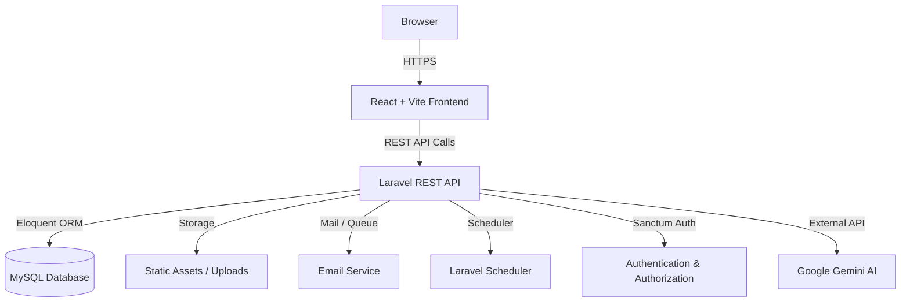
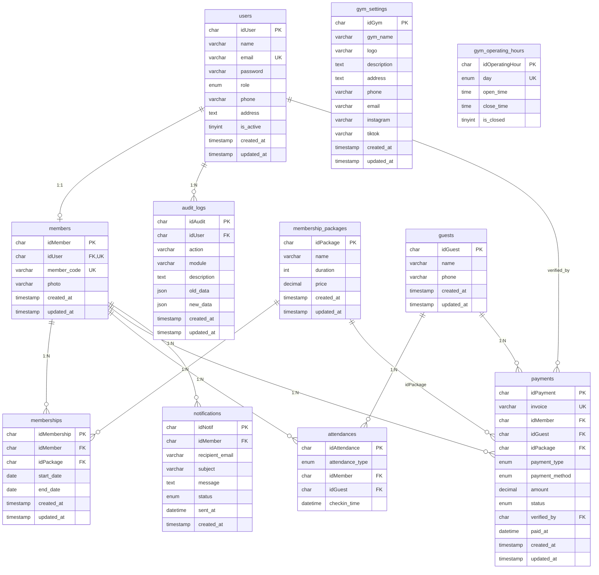

# PRD — Project Requirements Document

## 1. Overview
Combat Strength Gym Management System (CSGMS) adalah aplikasi berbasis web yang menggantikan pencatatan manual operasional gym sehari‑hari. Aplikasi ini menyatukan pengelolaan data member, paket membership, check‑in harian (member dan guest), pembayaran (hanya QRIS statis dan cash), invoice digital, serta pelaporan keuangan dan kehadiran dalam satu sistem terpusat.

Masalah yang diselesaikan:
- Admin kesulitan melacak masa aktif membership, pembayaran manual, dan kehadiran secara terpisah.
- Owner tidak memiliki visibilitas langsung terhadap pendapatan dan kehadiran harian/bulanan.
- Member tidak mudah mengetahui status membership, riwayat pembayaran, atau QR code check‑in.
- Guest tidak tercatat dengan rapi, menyulitkan pelaporan pendapatan harian.
- Tidak ada pengingat otomatis kepada member yang masa membership‑nya akan habis.

Tujuan utama:
- Memudahkan admin mengelola operasional gym (member, check‑in, pembayaran) secara efisien.
- Memberikan dashboard informatif kepada owner untuk pengambilan keputusan.
- Memberikan pengalaman mandiri kepada member (cek status, QR code, riwayat).
- Merekam setiap transaksi dan kehadiran secara real‑time, meminimalkan selisih dan kesalahan.
- Mengirim notifikasi email H‑3 sebelum membership expired dan menyediakan invoice elektronik.

## 2. Requirements
Persyaratan utama proyek:

- **Multi-role access**: Sistem harus mendukung empat peran: Owner, Admin, Member, Guest.
- **Dashboard terpisah**: Owner dan Admin memiliki dashboard dengan metrik berbeda sesuai kebutuhan.
- **Registrasi Member**: Calon member dapat membuat akun secara mandiri melalui landing page untuk mendapatkan akses ke dashboard member.
- **Manajemen member dan membership**: Admin dapat mengelola data member dan membership. Member dapat membeli membership pertama kali, melihat status membership, serta melakukan perpanjangan membership melalui dashboard member. Sistem menerapkan perpanjangan otomatis dari tanggal expired terakhir dan satu member hanya boleh memiliki satu membership aktif.
- **Check‑in harian terbatas**: Setiap member hanya bisa check‑in sekali per hari; hanya jika membership aktif.
- **QR Code statis**: Setiap member memiliki QR code unik (dari `member_code`) yang dapat dipindai untuk check‑in.
- **Guest tanpa akun**: Guest wajib mengisi nama dan nomor HP, lalu melakukan pembayaran harian sebelum otomatis tercatat check‑in.
- **Pembayaran terbatas**: Hanya mendukung dua metode: QRIS statis dan manual (cash), tanpa integrasi payment gateway.
- **Notifikasi expired**: Sistem mengirim notifikasi email kepada member 3 hari sebelum membership habis; tanpa WhatsApp.
- **Invoice digital**: Admin dapat mengirim invoice/bukti pembayaran melalui email setelah pembayaran dikonfirmasi.
- **Laporan operasional**: Owner dapat melihat dan mencetak laporan member, kehadiran, dan pendapatan (harian, bulanan) dengan pemisahan metode pembayaran.
- **Pengaturan gym**: Owner dapat mengatur nama gym, logo, deskripsi, alamat, nomor WhatsApp, email, sosial media, dan jam operasional per hari.
- **Audit log**: Semua perubahan data oleh admin atau sistem dicatat untuk keperluan lacak balik.
- **Manajemen akun admin**: Owner dapat membuat, mengedit, atau menonaktifkan akun admin.
- **Manajemen paket membership**: Admin dapat membuat paket 1, 3, 6, dan 12 bulan sesuai harga yang ditentukan.
- **Aturan membership**:
  - Member yang baru registrasi belum memiliki membership aktif.
  - Member yang belum memiliki membership aktif tidak dapat melakukan check-in.
  - QR Code hanya dibuat setelah membership pertama berhasil diaktifkan.
  - Satu member hanya dapat memiliki satu membership aktif pada satu waktu.
  - Perpanjangan membership menambah masa aktif dari tanggal expired terakhir.
  - Jika membership sudah expired, masa aktif baru dihitung dari tanggal pembayaran yang dikonfirmasi.

## 3. Core Features
- **Dashboard Owner**: Ringkasan kehadiran (member & guest), pendapatan harian, statistik member (aktif/expired/member baru), grafik kehadiran 7 hari dan pendapatan bulanan.
- **Dashboard Admin**: Kehadiran & pembayaran hari ini, peringatan membership akan expired 7 hari ke depan, pembayaran menunggu konfirmasi, dan permintaan perpanjangan membership yang menunggu verifikasi.
- **Manajemen Member**: Edit dan nonaktifkan member, mengelola akun member, serta mengelola foto member.
- **Registrasi Member**: Calon member dapat membuat akun melalui landing page dengan mengisi data diri seperti nama, email, nomor HP, alamat, password, dan foto wajah untuk mendapatkan akses ke dashboard member.
- **Paket Membership**: CRUD paket (nama, durasi dalam bulan, harga).
- **Transaksi Membership**: Pembelian membership pertama kali atau perpanjangan membership dengan status transaksi (“Menunggu Pembayaran”, “Lunas”, “Dibatalkan”). Setelah pembayaran dikonfirmasi admin, sistem mengaktifkan membership atau memperpanjang masa aktif membership dari tanggal expired terakhir.
- **Check‑in Member**: Pindai QR code oleh admin; validasi keaktifan membership; catat kehadiran maksimal satu kali per hari.
- **Registrasi & Check‑in Guest**: Form singkat (nama, no HP, metode bayar); setelah pembayaran dikonfirmasi, otomatis tercatat hadir.
- **Pembayaran**: Hanya dua metode: cash (langsung lunas) dan QRIS statis (admin konfirmasi manual).
- **Invoice & Notifikasi**: Kirim email invoice setelah pembayaran lunas; kirim notifikasi email otomatis ke member H‑3 sebelum expired.
- **QR Code Member**: Dibuat secara otomatis setelah membership pertama berhasil diaktifkan. QR Code menggunakan `member_code` sebagai identitas check-in dan dapat diunduh atau dicetak oleh member.
- **Perpanjangan Membership**: Member dapat memilih paket membership yang tersedia untuk memperpanjang masa aktif membership. Setelah pembayaran dikonfirmasi admin, sistem otomatis memperpanjang masa aktif membership dari tanggal expired terakhir.
- **Laporan & Cetak**: Filter rentang tanggal, cetak laporan member, kehadiran, pendapatan; pisahkan metode pembayaran cash dan QRIS.
- **Pengaturan Gym**: Owner edit info gym (nama, logo, deskripsi, alamat, kontak, email, sosial media) dan jam operasional per hari (buka/tutup).
- **Asisten Virtual (Hybrid Chatbot)**: Tersedia widget chatbot interaktif (pendekatan *hybrid* antara logika sistem dan AI Gemini) di Frontend. Chatbot memadukan data langsung dari database untuk mengecek status membership atau harga paket, lalu merangkainya dengan gaya bahasa natural dari AI.
- **Audit Log**: Catat aktivitas admin (create, update, delete) lengkap dengan timestamp, data lama dan baru.
- **Manajemen Akun Admin**: Owner tambah/edit/nonaktifkan akun admin.

## 4. Non Functional Requirements
- **Responsiveness**: Sistem harus responsif dan dapat digunakan dengan baik pada perangkat desktop maupun mobile.
- **Performance**: Sistem harus mampu menampilkan halaman dan memproses permintaan pengguna dengan waktu respons maksimal 3 detik pada kondisi penggunaan normal.
- **Capacity**: Sistem harus mampu mengelola dan menyimpan minimal 100 member aktif tanpa penurunan performa yang signifikan.
- **Security**: Password pengguna harus disimpan menggunakan metode hashing yang aman (bcrypt) dan akses sistem dibatasi berdasarkan peran pengguna.
- **Compatibility**: Sistem harus dapat berjalan dengan baik pada browser Google Chrome, Microsoft Edge, dan Mozilla Firefox.

## 5. User Flow
### Owner
1. Login → Dashboard Owner langsung menampilkan metrik hari ini & bulan ini.
2. Navigasi ke menu Laporan → pilih jenis laporan (Member/Kehadiran/Pendapatan) → filter tanggal → lihat atau cetak.
3. Menu Data → lihat data member, membership, kehadiran, pembayaran (read‑only).
4. Menu Pengaturan → ubah informasi gym dan jam operasional per hari.
5. Menu Akun Admin → tambah/edit/nonaktifkan akun admin.
6. Menu Audit Log → lihat riwayat aktivitas sistem.

### Admin
1. Login → Dashboard Admin menampilkan ringkasan operasional harian.
2. Kelola Member: melihat, mengubah, atau menonaktifkan akun member serta mengelola foto member.
3. Kelola Paket Membership: tambah, ubah, atau hapus paket membership.
4. Konfirmasi Pembayaran: melihat daftar transaksi dengan status “Menunggu Pembayaran” → melakukan verifikasi pembayaran → mengubah status menjadi “Lunas” → sistem mengirim invoice melalui email.
5. Aktivasi Membership → setelah pembayaran pertama dikonfirmasi, sistem mengaktifkan membership dan membuat QR Code member secara otomatis.
6. Check‑in: memindai QR Code menggunakan webcam/smartphone atau input manual member_code → sistem memvalidasi membership → mencatat kehadiran.
7. Guest Harian: mengisi data guest, memilih metode pembayaran, mengonfirmasi pembayaran → sistem otomatis mencatat check-in guest.
8. Memantau membership yang akan expired dalam 7 hari ke depan untuk keperluan tindak lanjut.

### Member
1. Registrasi akun melalui landing page dengan mengisi data diri dan mengunggah foto.
2. Login ke sistem → masuk ke Dashboard Member.
3. Jika belum memiliki membership aktif → dapat memilih paket membership yang tersedia.
4. Melakukan pembayaran membership (Cash atau QRIS) → menunggu konfirmasi admin.
5. Setelah pembayaran dikonfirmasi → membership aktif dan QR Code otomatis tersedia.
6. Dashboard Member: profil member, status membership (Aktif/Expired), QR code check-in, tombol unduh/print QR code check-in.
7. Melakukan perpanjangan membership dengan memilih paket yang tersedia.
8. Riwayat Pembayaran: daftar transaksi membership.
9. Riwayat Kehadiran: log check‑in per tanggal.
10. Terima email otomatis pada H‑3 sebelum membership expired.

### Guest
1. Datang ke gym
2. Admin membuka form Guest Harian.
3. Guest memberikan nama dan nomor HP kepada admin.
4. Admin memilih metode pembayaran (Cash atau QRIS)
5. Guest menyelesaikan pembayaran.
4. Admin konfirmasi → guest otomatis tercatat hadir (tidak membuat akun sistem).

## 6. Architecture

Penjelasan:
- **React + Vite** adalah single‑page application (SPA) yang menjadi antarmuka pengguna (UI). Dideploy secara terpisah atau disajikan melalui web server yang sama, ia berkomunikasi murni melalui REST API ke backend Laravel.
- **Laravel REST API** menangani seluruh logika bisnis, validasi data, autentikasi multi‑role (Owner, Admin, Member), pengelolaan file, pengiriman email, dan penjadwalan tugas.
- **MySQL** sebagai database relasional utama, diakses oleh Laravel melalui Eloquent ORM untuk keamanan dan kemudahan migrasi skema.
- **File Storage** (Laravel Storage) menyimpan logo gym, foto member, dan gambar QR code yang dihasilkan; bisa menggunakan disk lokal atau cloud storage.
- **Email Service**: Laravel Mail mengirim invoice dan notifikasi H‑3 expired. Proses pengiriman berat (notifikasi otomatis) dijalankan secara asinkron melalui Laravel Queue dan dijadwalkan oleh Laravel Scheduler, sehingga tidak memperlambat respons API.
- **Sanctum Authentication** menyediakan token API (atau cookie‑based session) untuk mengamankan endpoint; middleware membedakan peran pengguna.
- **Hybrid Chatbot (AI & Sistem)**: Backend API memadukan logika pengambilan data internal (seperti paket dan status member) dengan pemrosesan bahasa alami dari Google Gemini untuk menghasilkan respons yang akurat, sesuai konteks gym, dan luwes.
- Seluruh perubahan data penting dicatat oleh aplikasi Laravel ke dalam tabel audit log, tanpa memerlukan lapisan terpisah.

## 7. Database Schema

Skema database terdiri dari 11 tabel untuk mendukung seluruh fitur. Berikut daftar tabel beserta kolom utama, tipe data (dalam sintaks MySQL), dan kegunaannya. *UUID disimpan sebagai `CHAR(36)`, boolean sebagai `TINYINT(1)`.*

### 7.1 Daftar Tabel dan Kolom

#### users
Menyimpan data akun semua peran (owner, admin, member).
- `idUser` CHAR(36) (PRIMARY KEY)
- `name` VARCHAR(255) NOT NULL
- `email` VARCHAR(255) NOT NULL UNIQUE
- `password` VARCHAR(255) NOT NULL
- `role` ENUM('owner','admin','member') NOT NULL
- `phone` VARCHAR(20) NOT NULL
- `address` TEXT NOT NULL
- `is_active` TINYINT(1) NOT NULL DEFAULT 1
- `created_at` TIMESTAMP NOT NULL
- `updated_at` TIMESTAMP NOT NULL

#### members
Data khusus member, terhubung 1:1 dengan `users`.
- `idMember` CHAR(36) (PRIMARY KEY)
- `idUser` CHAR(36) (FOREIGN KEY → users.idUser, UNIQUE)
- `member_code` VARCHAR(20) NULL UNIQUE (identitas QR code)
- `photo` VARCHAR(255) NOT NULL (path foto)
- `created_at` TIMESTAMP NOT NULL
- `updated_at` TIMESTAMP NOT NULL

#### membership_packages
Paket membership yang ditawarkan.
- `idPackage` CHAR(36) (PRIMARY KEY)
- `name` VARCHAR(255) NOT NULL
- `duration` INT NOT NULL (lama dalam bulan)
- `price` DECIMAL(12,2) NOT NULL
- `created_at` TIMESTAMP NOT NULL
- `updated_at` TIMESTAMP NOT NULL

#### memberships
Mencatat membership yang diambil oleh member.
- `idMembership` CHAR(36) (PRIMARY KEY)
- `idMember` CHAR(36) (FOREIGN KEY → members.idMember)
- `idPackage` CHAR(36) (FOREIGN KEY → membership_packages.idPackage)
- `start_date` DATE NOT NULL
- `end_date` DATE NOT NULL
- `created_at` TIMESTAMP NOT NULL
- `updated_at` TIMESTAMP NOT NULL

#### payments
Transaksi pembayaran, bisa untuk membership member atau guest harian.
- `idPayment` CHAR(36) (PRIMARY KEY)
- `invoice` VARCHAR(50) NOT NULL UNIQUE
- `idMember` CHAR(36) NULL (FOREIGN KEY → members.idMember, diisi jika membership)
- `idGuest` CHAR(36) NULL (FOREIGN KEY → guests.idGuest, diisi jika guest)
- `idPackage` CHAR(36) NULL (FOREIGN KEY → membership_packages.idPackage)
- `payment_type` ENUM('new_membership','renew_membership','guest')  NOT NULL
- `payment_method` ENUM('qris','cash') NOT NULL
- `amount` DECIMAL(12,2) NOT NULL
- `status` ENUM('pending','paid','cancel') NOT NULL
- `verified_by` CHAR(36) NULL (FOREIGN KEY → users.idUser)
- `paid_at` DATETIME NULL
- `created_at` TIMESTAMP NOT NULL
- `updated_at` TIMESTAMP NOT NULL

#### guests
Data pengunjung harian (tanpa akun).
- `idGuest` CHAR(36) (PRIMARY KEY)
- `name` VARCHAR(255) NOT NULL
- `phone` VARCHAR(20) NOT NULL
- `created_at` TIMESTAMP NOT NULL
- `updated_at` TIMESTAMP NOT NULL

#### attendances
Catatan check‑in harian (member atau guest).
- `idAttendance` CHAR(36) (PRIMARY KEY)
- `attendance_type` ENUM('member','guest') NOT NULL
- `idMember` CHAR(36) NULL (FOREIGN KEY → members.idMember)
- `idGuest` CHAR(36) NULL (FOREIGN KEY → guests.idGuest)
- `checkin_time` DATETIME NOT NULL

#### audit_logs
Jejak audit aktivitas admin/owner.
- `idAudit` CHAR(36) (PRIMARY KEY)
- `idUser` CHAR(36) (FOREIGN KEY → users.idUser)
- `action` VARCHAR(255) NOT NULL
- `module` VARCHAR(255) NOT NULL
- `description` TEXT NOT NULL
- `old_data` JSON NULL
- `new_data` JSON NULL
- `created_at` TIMESTAMP NOT NULL
- `updated_at` TIMESTAMP NOT NULL

#### notifications
Log notifikasi email yang dikirim kepada member.
- `idNotif` CHAR(36) (PRIMARY KEY)
- `idMember` CHAR(36) (FOREIGN KEY → members.idMember)
- `recipient_email` VARCHAR(255) NOT NULL
- `subject` VARCHAR(255) NOT NULL
- `message` TEXT NOT NULL
- `status` ENUM('sent','failed') NOT NULL
- `sent_at` DATETIME NULL
- `created_at` TIMESTAMP NOT NULL

#### gym_settings
Informasi gym (singleton, biasanya satu baris).
- `idGym` CHAR(36) (PRIMARY KEY)
- `gym_name` VARCHAR(255) NOT NULL
- `logo` VARCHAR(255) NULL
- `description` TEXT NOT NULL
- `address` TEXT NOT NULL
- `phone` VARCHAR(20) NOT NULL
- `email` VARCHAR(255) NOT NULL
- `instagram` VARCHAR(255) NULL
- `tiktok` VARCHAR(255) NULL
- `created_at` TIMESTAMP NOT NULL
- `updated_at` TIMESTAMP NOT NULL

#### gym_operating_hours
Jam operasional gym per hari.
- `idOperatingHour` CHAR(36) (PRIMARY KEY)
- `day` ENUM('Monday','Tuesday','Wednesday','Thursday','Friday','Saturday','Sunday') NOT NULL UNIQUE
- `open_time` TIME NULL
- `close_time` TIME NULL
- `is_closed` TINYINT(1) NOT NULL DEFAULT 0
- *(tidak ada foreign key – diasumsikan berlaku untuk gym_settings yang ada)*

### 7.2 Diagram ER

## 8. Tech Stack

Rekomendasi teknologi dengan arsitektur frontend‑backend terpisah menggunakan React + Vite untuk antarmuka dan Laravel sebagai REST API backend.

- **Frontend Framework**: [React](https://react.dev/) dengan [Vite](https://vitejs.dev/) — pengembangan cepat, build optimal, dan komponen interaktif.
- **Styling**: [Tailwind CSS](https://tailwindcss.com/) — utility‑first untuk antarmuka responsif.
- **UI Components**: [shadcn/ui](https://ui.shadcn.com/) — komponen berbasis Radix UI & Tailwind, mudah dikustomisasi dan langsung terintegrasi dengan React.
- **Backend Framework**: [Laravel](https://laravel.com/) — REST API server‑side dengan ekosistem lengkap untuk autentikasi, validasi, notifikasi, queue, dan manajemen database.
- **Database**: [MySQL](https://www.mysql.com/) — relasional, andal, dikelola langsung oleh Laravel melalui Eloquent ORM dan Migration.
- **ORM & Migrasi**: [Eloquent ORM](https://laravel.com/docs/eloquent) + [Laravel Migration](https://laravel.com/docs/migrations) — query builder object‑relational yang kuat beserta version control skema database.
- **Authentication & Authorization**: [Laravel Sanctum](https://laravel.com/docs/sanctum) — autentikasi token untuk SPA (React) berbasis cookie/session atau API token, mendukung multi‑role (owner, admin, member) dengan middleware bawaan.
- **Validation**: [Laravel Form Request Validation](https://laravel.com/docs/validation#form-request-validation) — validasi request type‑safe, memastikan data yang masuk ke API sesuai aturan.
- **AI Integration**: [Google Gemini API](https://ai.google.dev/) — ditenagai oleh model bahasa besar (LLM) yang diintegrasikan secara *hybrid* dengan data database untuk fitur asisten virtual interaktif (Hybrid Chatbot).
- **QR Code Generation**: `endroid/qr-code` (PHP) — membuat QR code statis dari `member_code` di sisi backend, gambar disimpan melalui Laravel Storage.
- **Email Service**: [Laravel Mail](https://laravel.com/docs/mail) dengan SMTP/Resend — kirim invoice dan notifikasi H‑3 expired, dijalankan oleh Laravel Scheduler dan Queue untuk proses asinkron.
- **Scheduler & Queue**: [Laravel Scheduler](https://laravel.com/docs/scheduling) + [Laravel Queue](https://laravel.com/docs/queues) — otomatiskan pengiriman email reminder expired dan pembuatan invoice tanpa menunggu request.
- **PDF Generation**: [DOMPDF](https://github.com/dompdf/dompdf) — cetak laporan kehadiran, pendapatan, dan data member langsung dari blade view menjadi PDF.
- **File Upload**: [Laravel Storage](https://laravel.com/docs/filesystem) — simpan logo gym, foto member, dan QR code di local disk atau cloud storage (S3, Cloudinary).
- **Deployment**:
  - React + Vite frontend dapat di‑build sebagai static asset dan dideploy ke Vercel, Netlify, atau di‑serve oleh web server (Nginx/Apache).
  - Laravel backend dideploy di VPS bersama MySQL (misalnya menggunakan Laravel Forge, Ploi, atau manual LAMP stack).
  - Keduanya dapat berbagi domain yang sama dengan reverse proxy Nginx: `/` mengarah ke React static, `/api` ke Laravel.
  - Alternatif: keduanya di satu VPS menggunakan Docker Compose. Pilih sesuai kenyamanan infrastruktur.

Stack ini dipilih agar pengembangan frontend reaktif dengan React tetap cepat, sementara backend Laravel menyediakan fondasi yang solid, aman, dan mudah dikembangkan untuk kebutuhan operasional gym.